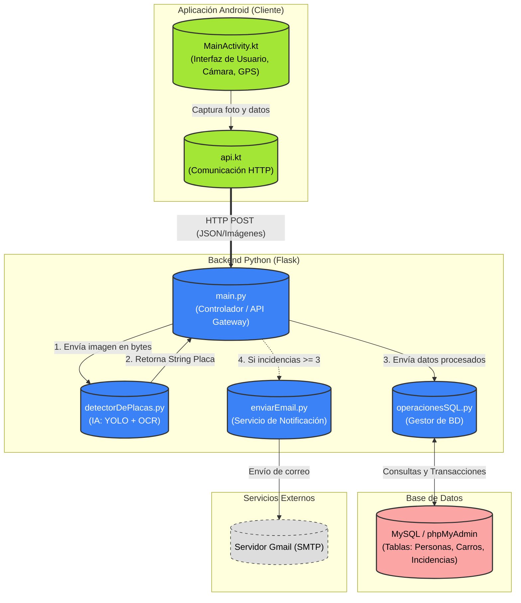

# DEMO

<div align="center">
    

https://github.com/user-attachments/assets/3a3df5b8-50d0-4fbd-8b15-1b28151819c1


</div>


# Diagrama de Componentes


## Comunicación Cliente - Servidor

En nuestro código Kotlin, tenemos el objeto:


```kotlin
// #################### COMUNICACIÓN CON LA API ####################
// Se usa un solo objeto REtrofitClient para todas las llamadas
object RetrofitClient {
      private const val BASE_URL = "https://tu-url-gratuita.ngrok-free.dev" // URL de la API que obtuvimos al usar la versión gratuita de ngrok. 
    val instance: ApiService by lazy {
        val retrofit = Retrofit.Builder()
            .baseUrl(BASE_URL)
            .addConverterFactory(GsonConverterFactory.create())
            .build()
        retrofit.create(ApiService::class.java)
    }
}
```
Este objeto se encuentra dentro de nuestro archivo `MainActivity.kt` y se usa para comunicarse con el archivo `api.kt` que tiene el código que se encarga de los endpoints:

```kotlin
data class ApiResponse(
    @SerializedName("placa") val placa: String?,
    @SerializedName("mensaje") val mensaje: String?,
    @SerializedName("error") val error: String?,
    @SerializedName("nombre") val nombre: String?,
    @SerializedName("apPaterno") val apPaterno: String?,
    @SerializedName("email") val email: String?
)

interface ApiService {

    // Llamada a la API para el detector
    @Multipart
    @POST("enviarImagen")
    suspend fun subirParaDetectar(
        @Part imagen: MultipartBody.Part
    ): ApiResponse

    // Llamada a la API para registrar
    @Multipart
    @POST("registrarPlaca")
    suspend fun subirParaRegistrar(
        @Part imagen: MultipartBody.Part,
        @Part("nombre") nombre: RequestBody,
        @Part("apPaterno") apPaterno: RequestBody,
        @Part("apMaterno") apMaterno: RequestBody,
        @Part("email") email: RequestBody
    ): ApiResponse

    // Llamada a la API para reportar
    @Multipart
    @POST("crearReporte")
    suspend fun reportarIncidencia( //
        @Part imagen: MultipartBody.Part,
        @Part("descripcion") descripcion: RequestBody,
        @Part("lat") lat: RequestBody,
        @Part("lng") lng: RequestBody
    ): ApiResponse
}
```
Ejemplo:
```Kotlin
val apiResponse = RetrofitClient.instance.subirParaDetectar(body)
```

El objeto `RetrofitClient` manda a llamar la función `subirParaDetectar` que se encuentra en nuestro archivo `api.kt` como se vio anteriormente.


Nos aseguramos que los `@POST` coincidan con aquellos definidos en nuestro `main.py`, por ejemplo:

```Python
@app.route("/registrarPlaca", methods=["POST"])
def registrarPlaca():
```


# Entrenamiento del modelo

Para este proyecto, tomamos un [dataset gratuito de Kaggle](https://www.kaggle.com/datasets/harshitsingh09/license-plate-detection-dataset-anpr-yolo-format) y lo usamos para nosotros entrenar el modelo.

Realizamos el entrenamiento nosotros mismos 3 veces.

- Entrenamiento Default (1 hora, 25 Epochs)
- Entrenamiento Normal (2 horas, 100 Epochs)
- Entrenamiento Avanzado (6 horas, 150 Epochs)

El entrenamiento de 2 horas y el de 6 horas fueron similares, la diferencia enorme de tiempo con solo 50 Epochs de diferencia es por las distintas formas que ofrece YOLO de configurar el entrenamiento.

Para el de 2 horas utilizamos el modelo `nano`, que suele ser más ligero y rápido. Se entrenó con el siguiente comando:


``` 
yolo task=detect mode=train model=yolov8n.pt data=ruta/data.yaml epochs=100 imgsz=640
```

Con ese modelo, el programa batalló un poco con algunas placas, así que optamos por un segundo entrenamiento, ahora bajo el modelo `small`
que es conocido por ser más pesado, pero por lo tanto más eficaz. Se entrenó de la siguiente manera:

``` 
yolo task=detect mode=train model=yolov8s.pt data=ruta/data.yaml epochs=150 imgsz=640
```

Lo único que cambia en ambos comandos es la letra en `model=yolov8[s/n],pt`.

Al final, nos quedamos con el modelo `small`:


# Pruebas

Una ventaja de entrenar con YOLO es que nos genera automáticamente resultados gráficos del entrenamiento como la matriz de confusión, la curva F1, entre otros.


Esta imagen nos indica que, con los datos que se usaron para entrenar y testear (nuestro dataset de Kaggle) de 158 placas, detectó 136 con seguridad, tuvo 9 falsos positivos y 22 falsos negativos. Si bien suena a una cantidad grande de errores, realmente estamos frente a solamente un 13.92% de errores, un numero aceptable para el objetivo de este proyecto teniendo en cuenta que fue un enterenamiento "hecho en casa".
______________


Esta grafica nos dice cual es el mejor punto de confianza que tendríamos que usar, de acuerdo a los resultados obtenidos. En este caso, los mejores resultados estuvieron alrededor del `0.514` de confianza.

Lo ideal hubiese sido usar estos datos en nuestro código de Python, pero hacer esto nos produjo errores. Muchas placas eran ignoradas ya durante la etapa de testeo, ya que el modelo esperaba imagenes más parecidas a la que se usaron para entrenar.

Construir un dataset manual era imposible debido a los tiempos, así que tuvimos que pensar en una forma de solucionar esto, y lo que hicimos al final fue usar una confianza más baja `0.15`. Haciendo esto, el modelo iba a permitir más placas que antes quizá tomaba como falsos positivos. Ya para luchar contra este valor tan "amigable", implementamos las funciones de validación manual en nuestro código de Python. En otras palabras, preferible que YOLO detecte algo de más y ya nosotros filtrarlo manualmente, que no recibir nada de YOLO.
